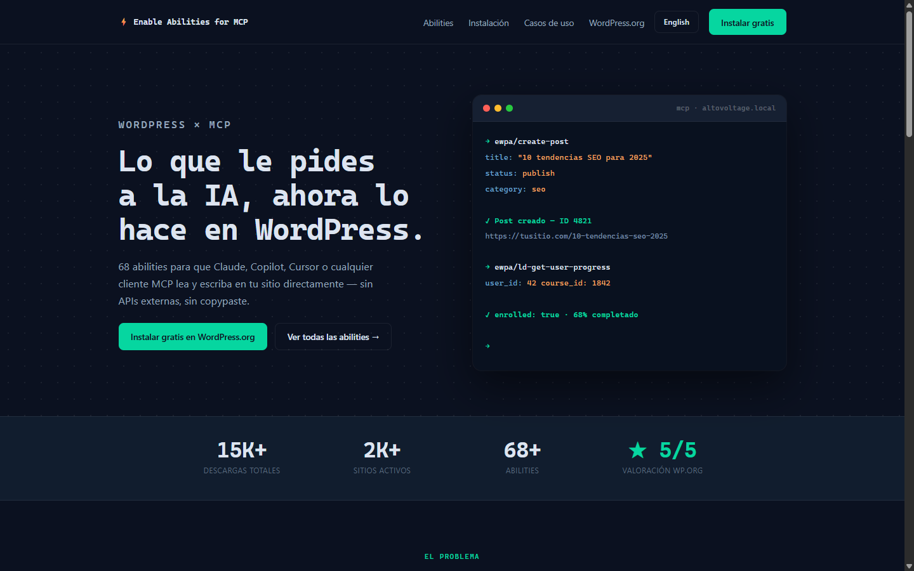

# Enable Abilities for MCP — Landing Page

Marketing site for [Enable Abilities for MCP](https://wordpress.org/plugins/enable-abilities-for-mcp/), a free, open-source WordPress plugin (GPLv2) that lets Claude, Copilot, Cursor and any MCP-compatible client read and write directly on a WordPress site — 68+ abilities across 15 categories, 15K+ downloads, 5/5 rating on WordPress.org.

**Live:** [mcp.fabiomontenegro.com](https://mcp.fabiomontenegro.com) (Spanish) · [/en/](https://mcp.fabiomontenegro.com/en/) (English)



## Stack

- [Astro 5](https://astro.build) — fully static output, zero client-side JavaScript frameworks
- TypeScript — typed i18n content contracts
- [Cloudflare Workers + Assets](https://developers.cloudflare.com/workers/static-assets/) — hosting, auto-deploy on push to `main` via Git integration
- pnpm — strict dependency isolation

## i18n Architecture

No i18n framework. Each locale is a typed TypeScript module and components receive content as an explicit prop:

```astro
---
import type { LandingT } from '../i18n/es';
interface Props { t: LandingT }
const { t } = Astro.props;
---
```

`src/i18n/es.ts` defines the `LandingT` type; `src/i18n/en.ts` implements it, so the compiler guarantees every locale covers every string. Adding a language is one content file plus one route — no global state, no runtime cost.

```
src/
  i18n/          # es.ts (source of LandingT), en.ts
  layouts/       # Layout.astro — design tokens, dark/light theme
  components/    # Hero, Stats, Compare, Categories, Cases, ...
  pages/         # index.astro (ES), en/index.astro (EN)
```

## Development

```bash
pnpm install
pnpm dev        # dev server
pnpm build      # static build to dist/
pnpm preview    # preview the build
```

## Deploy

Pushing to `main` triggers a Cloudflare Workers build that publishes `dist/` as static assets (`wrangler.toml`). No CI pipeline needed.

## Author

**Fabio Montenegro** — WordPress developer building the infrastructure that lets AI work inside WordPress.

- Plugin: [wordpress.org/plugins/enable-abilities-for-mcp](https://wordpress.org/plugins/enable-abilities-for-mcp/)
- Web: [fabiomontenegro.com](https://fabiomontenegro.com)
- LinkedIn: [fabio-montenegro](https://www.linkedin.com/in/fabio-montenegro/)
